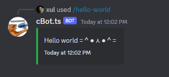

# cBot.ts (IN-DEVELOPMENT) (CONTRIBUITIONS NEDDED)
A comprehensive chatbot framework that integrates with multiple instant messaging platforms.

# Installation

```bash
npm i cBot.ts
```

# Usage

### Define an env var file like this:
```ts
export const env = {
  PORT: 7070,
  RUN_COMMAND_DEPLOYER: true,
  CLIENT_ID: '<YOUR_CLIENT_ID>',
  GUILD_ID: '<YOUR_DISCORD_SERVER_ID>',
  BOT_TOKEN: '<YOUR_BOT_TOKEN>',
};

  ```ts
  // Configure command handlers
  const helloWorldCommandHandler = (args: CommandCallbackArgs): cMessage | void => {
    //Platform agnostic reply
    const message: cMessage = {
      theme: DefaultTheme,
      content: 'Hello world =＾● ⋏ ●＾=',
      actions: YesOrNoAction(
        (payload: cActionContext) => { myLogger.info(`Yes Clicked ${ payload.dependency?.get('BotApp')}`) },
        (payload: cActionContext) => { myLogger.info('No Clicked') }
      )
    }

    return message
  }

  const helloWorldCommand: Command = {
    commandName: 'hello-world',
    commandDescription: 'hello world command description :)',
    arguments: [],// No arguments for this example...
    callback: helloWorldCommandHandler,
  }


  const mockCBootConfig: cBootConfig = {
    port: env.PORT,
    deploy: env.RUN_COMMAND_DEPLOYER,
    clientKey: env.BOT_TOKEN, 
    clientId: env.CLIENT_ID,
    serverId: env.GUILD_ID,
    commands: [helloWorldCommand], // Fill with actual dummy Commands
    logger: myLogger
  }

  // Define the callback function to handle the bot startup
  const onStarted = (args: OnStartedArgs) => {
    myLogger.info('onStarted: Add Additional logic after the bot has started')
  }

  // Start the bot
  cBot.startBot(mockCBootConfig, onStarted)
  ```

### Verfy startup logs:
```bash
[your-date-time] [INFO] cBot - SERVICE [[CONFIG]] HAS BEEN STARTED SUCCESSFULLY
[your-date-time] [INFO] cBot - STARTED TO DEPLOYING APPLICATION (/) COMMANDS OR ANY UNDERYLING COMMAND DEPLOYMENT.
[your-date-time] [WARN] cBot - COMMAND BUILDER: BUILDING DISCORD SLASH COMMAND FOR: HELLO-WORLD
[your-date-time] [WARN] cBot - COMMANDS TO USE #: 1
[your-date-time] [INFO] cBot - SERVICE [[BOTAPP]] HAS BEEN STARTED SUCCESSFULLY
[your-date-time] [INFO] cBot - SERVICE [[BOOTSTRAP]] HAS BEEN STARTED SUCCESSFULLY
[your-date-time] [INFO] cBot - ONSTARTED: ADD ADDITIONAL LOGIC AFTER THE BOT HAS STARTED
[your-date-time] [INFO] cBot - SUCCESSFULLY RELOADED APPLICATION (/) COMMANDS.
[your-date-time] [INFO] cBot - DISCORD BOT READY =＾● ⋏ ●＾=
[your-date-time] [WARN] cBot - INTERACTION RECIVED:XXXXXXXXXXXXXXXXXXX
[your-date-time] [WARN] cBot - COMMAND CALLED: HANDLER:HELLO-WORLD
```

### Interact with your `/hello-world` slash command on discord and you must see this as response

